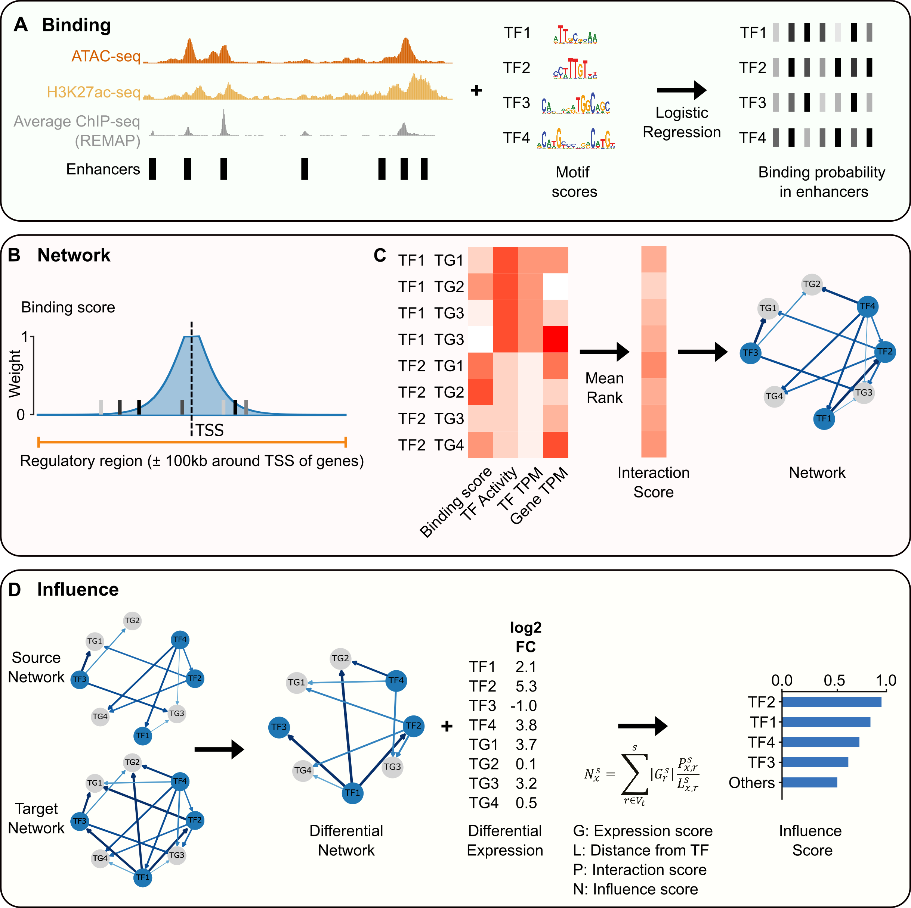

# ANANSE: ANalysis Algorithm for Networks Specified by Enhancers
[](http://bioconda.github.io)
[](https://anaconda.org/bioconda/ananse)
[](https://anaconda.org/bioconda/ananse)

[](https://anansepy.readthedocs.io/en/master/?badge=master)
[](https://anaconda.org/bioconda/ananse)

[](https://codeclimate.com/github/vanheeringen-lab/ANANSE/maintainability)
[](https://codeclimate.com/github/vanheeringen-lab/ANANSE/test_coverage)
### Prediction of key transcription factors in cell fate determination using enhancer networks
ANANSE is a computational approach to infer enhancer-based gene regulatory networks (GRNs) and to use these GRNs to identify the key transcription factors in cell fate determination. You can use it to generate a shortlist of transcription factors for trans-differentiation experiments, but also to generate cell type-specific gene regulatory networks or to study transcription regulation during development and differentiation. It is written in Python and it contains three command-line scripts: `ananse binding`, `ananse network`, and `ananse influence`. A graphical overview of the tools is shown below.



## Quick start

Read the **[full ANANSE documentation](https://anansepy.readthedocs.io/en/master/)** for detailed installation instructions and usage examples. For documentation on the **development version** see [here](https://anansepy.readthedocs.io/en/develop/).

### Installation

The most straightforward way to install ANANSE is via conda using the bioconda channel.

#### 1. If you have not used bioconda before, first set up the necessary channels (in this order!). You only have to do this once.

```
$ conda config --add channels defaults
$ conda config --add channels bioconda
$ conda config --add channels conda-forge
```

#### 2. Install ANANSE from bioconda

``` 
# Create an environment called ananse with all dependencies
$ conda create -n ananse ananse

# Activate the environment
$ conda activate ananse
```

Don't forget to activate the environment with `conda activate ananse` whenever you want to use ANANSE.

### Usage

The three command-line tools (`binding`, `network` and `influence`) can be used separately, but are designed to work together. In general, for a full ANANSE analysis, you would infer binding and calculate the GRN for two (or more) different cell types and then use `ananse influence` to determine influential TFs for the transition from one cell type to the other.

Before you can use the ANANSE tools, you have to install your genome with corresponding annotation using [genomepy](https://github.com/vanheeringen-lab/genomepy). For instance, to use `hg38`:

```
genomepy install hg38 --annotation
```


#### Genome-wide prediction of transcription factor binding: ananse binding

To predict binding, you need either ATAC-seq and/or H3K27ac ChIP-seq data as BAM files. Using both of these types of data will give the most accurate results, however, either of the two will also work. ANANSE will automatically choose the relevant model depending on which data you use as input. If you have human data, mapped to `hg38`, you can use a more advanced model based on 

```
ananse binding -A <ATAC.bam> -H <H3k27ac.bam> -o out
```


#### Gene regulatory network inference: ananse network

To create a gene regulatory network you will need a binding prediction from `ananse binding` and one or more files with gene expression quantification. The file should have the gene identifier in the first column and a column with `TPM` as a head. Both the `quant.sf` from salmon or the `abundances.tsv` from kallisto will work fine. Here we will run `ananse network` with 4 threads:

```
ananse network -b out/binding.tsv -e xxx -o network.txt -n 4
```

#### Transcription factor influence score: ananse influence

```
```

## Development installation

* Clone the repo from git.
* Checkout the `develop` branch.
* Install a development environment with conda: `conda env create -n ananse_dev -f requirements.yaml`.
* Activate the environment with `conda activate ananse_dev`.
* Install ANANSE with `python setup.py develop`.
  
## Citation

  > Xu Q, Georgiou G, Veenstra G J C, et al. ANANSE: An enhancer network-based computational approach for predicting key transcription factors in cell fate determination[J]. [bioRxiv](https://www.biorxiv.org/content/10.1101/2020.06.05.135798v2), 2020.

<!-- --- -->
## Help and Support

* The preferred way to get support is through the [Github issues page](https://github.com/vanheeringen-lab/ANANSE/issues).

## License

  - **[MIT license](http://opensource.org/licenses/mit-license.php)** [](https://anaconda.org/qxuchn/ananse)
  - Copyright 2020 © <a href="https://github.com/vanheeringen-lab" target="_blank">vanheeringen-lab</a>.
